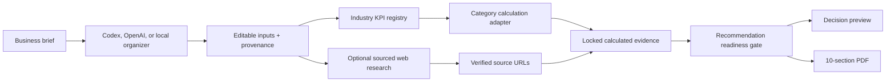

# Shadow Company architecture

## Calculation boundary

Known industries use built-in KPI definitions. Hotels use a capacity-constrained adapter with room inventory, occupancy, ADR, channel costs, elasticity, and break-even analysis. AI subscription businesses use a dedicated adapter with paid-account scale curves, usage percentiles, direct AI and retry costs, churn, price-volume response, allowances, overage pricing, and technical routing sensitivity. Unknown industries may receive AI-selected KPIs only from the approved formula library. AI cannot create a result; a formula runs only after required inputs are mapped.

## Evidence boundary

- User inputs, AI-suggested assumptions, sourced external context, and calculated results are separate data classes.
- External research cannot overwrite company inputs or represent itself as company performance.
- A separate evidence-confidence policy controls report status, displayed precision, report length, and whether winner language is allowed.
- Research findings without a returned source URL are discarded.
- Industry adapters can block a winning recommendation when required data is missing.
- Hotel simplified operating contribution is never labelled ending cash, EBITDA, net income, or cash flow.

## Research

OpenAI API mode uses Responses API `web_search`, retains returned sources, and displays them as clickable links. Codex account mode can attempt focused live search through an isolated read-only research thread. All search paths have a hard timeout; unavailable research does not block the calculated report.

## Server routes

- `GET /api/status`: provider, engine, and research capability.
- `POST /api/compile`: organize a brief into editable inputs.
- `POST /api/research`: run focused sourced industry research.
- `POST /api/simulate`: general deterministic scenario evidence.
- `POST /api/report`: research, calculate, gate, render, and cache a report.
- `GET /api/reports/:id.pdf`: download a private cached PDF.

## PDF safeguards

The report is intentionally short. Every drawing helper uses explicit page coordinates and widths. Footers stay inside PDFKit's margin boundary. Automated PDF.js tests reject footer-only pages, excessive page counts, and character-by-character wrapping.
